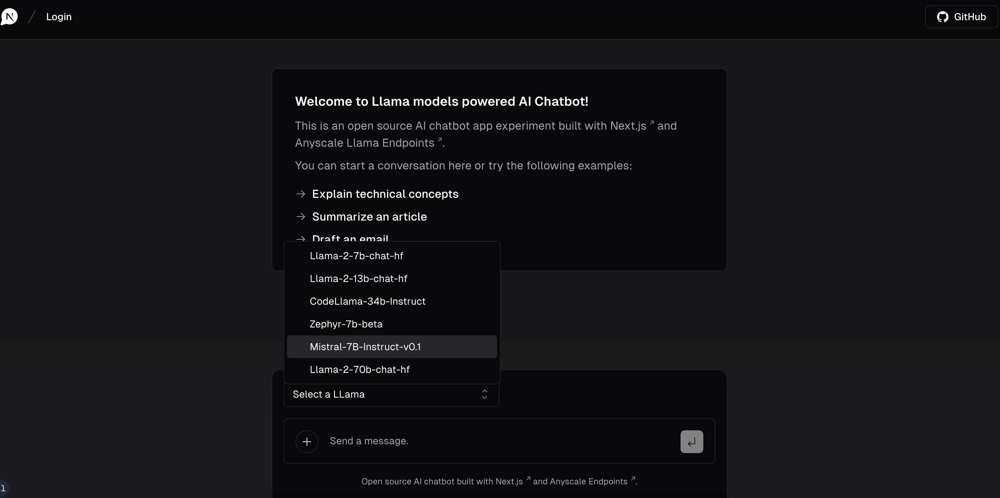

<a href="https://chat.vercel.ai/">
  
  <h1 align="center">Llama models powered AI Chatbot</h1>
</a>

<p align="center">
  An open-source AI chatbot app experiment built with Next.js, the Vercel AI SDK and Anyscale Endpoints.
</p>

<p align="center">
  <a href="#features"><strong>Features</strong></a> ·
  <a href="#model-providers"><strong>Model Providers</strong></a> ·
  <a href="#running-locally"><strong>Running locally</strong></a> ·
  <a href="#authors"><strong>Authors</strong></a>
</p>
<br/>

## Features

- Try Different Llama model variants in this chatbot
- [Anyscale Endpoints](https://www.anyscale.com/endpoints) for various Llama models to try out.
- [Next.js](https://nextjs.org) App Router
- React Server Components (RSCs), Suspense, and Server Actions
- [Vercel AI SDK](https://sdk.vercel.ai/docs) for streaming chat UI
- [shadcn/ui](https://ui.shadcn.com)
  - Styling with [Tailwind CSS](https://tailwindcss.com)
  - [Radix UI](https://radix-ui.com) for headless component primitives
  - Icons from [Phosphor Icons](https://phosphoricons.com)

## Model Providers

This experiment ships with Llama models. Thanks to the [Anyscale Endpoints](https://www.anyscale.com/endpoints), you can choose any of the available [Llama models](https://docs.endpoints.anyscale.com/category/supported-models).

## Vercel AI SDK

This whole project is based off of the [Next.js AI chatbot template](https://vercel.com/templates/next.js/nextjs-ai-chatbot)

## Running locally

You will need to use the environment variables [defined in `.env.example`](.env.example) to run Next.js AI Chatbot. It's recommended you use [Vercel Environment Variables](https://vercel.com/docs/projects/environment-variables) for this, but a `.env` file is all that is necessary.

> Note: You should not commit your `.env` file or it will expose secrets that will allow others to control access to your various OpenAI and authentication provider accounts.

1. Install Vercel CLI: `npm i -g vercel`
2. Link local instance with Vercel and GitHub accounts (creates `.vercel` directory): `vercel link`
3. Download your environment variables: `vercel env pull`

```bash
pnpm install
pnpm dev
```

Your app template should now be running on [localhost:3000](http://localhost:3000/).

## Standing on the shoulders of giant:

- [Vercel](https://vercel.com) 
- [Next.js](https://nextjs.org)
- [Anyscale Endpoints](https://www.anyscale.com/endpoints)
- [Next.js AI Chatbot](https://vercel.com/templates/next.js/nextjs-ai-chatbot)